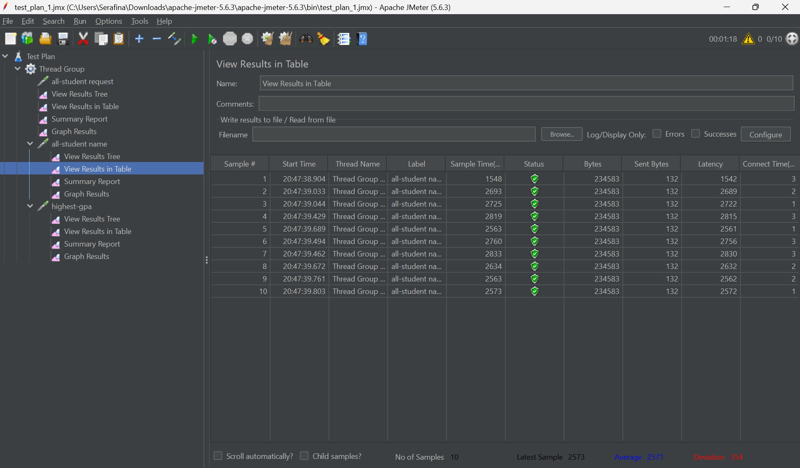
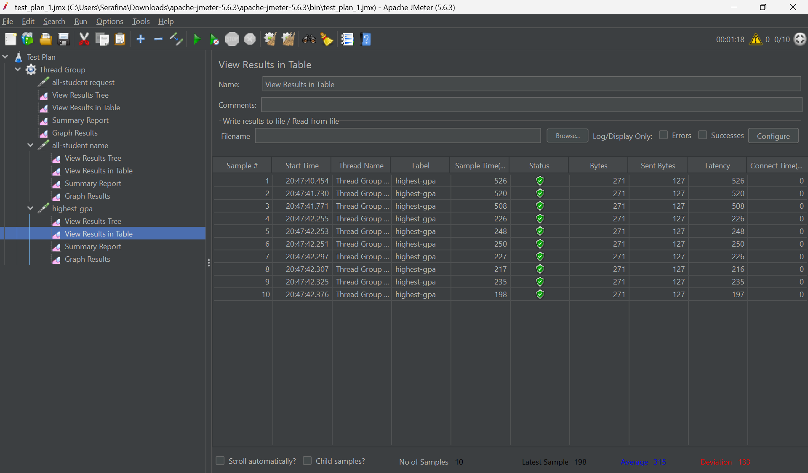
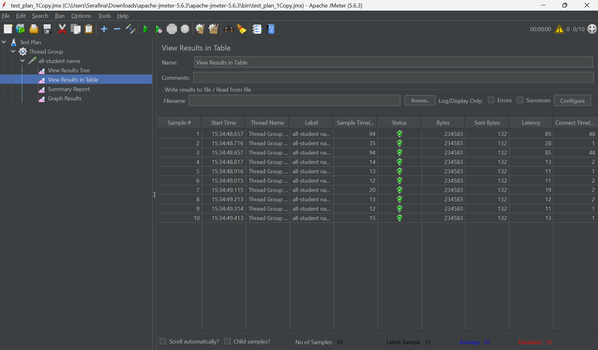
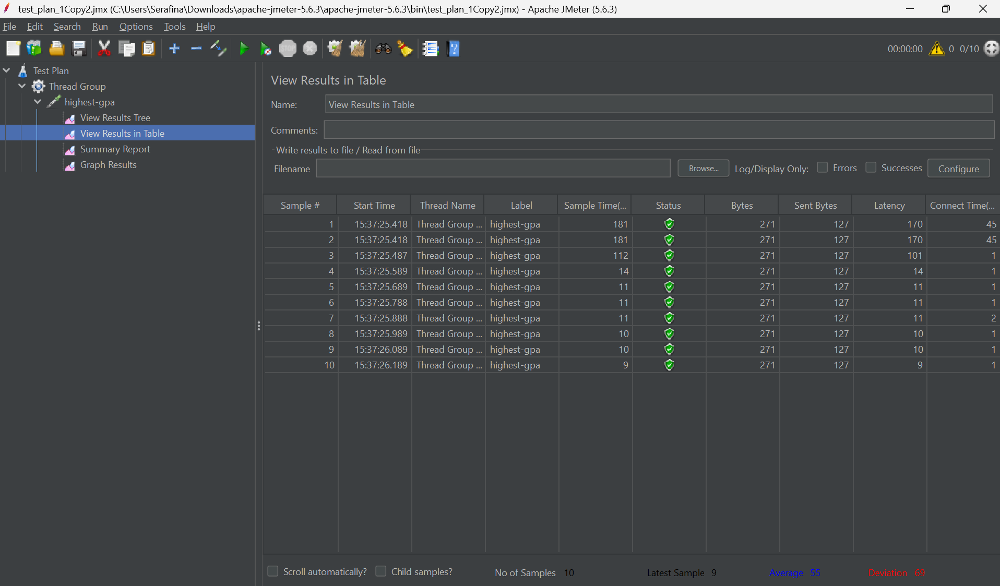
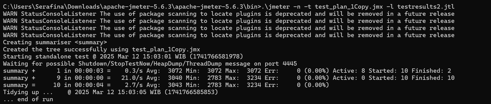
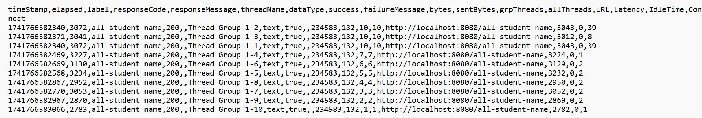
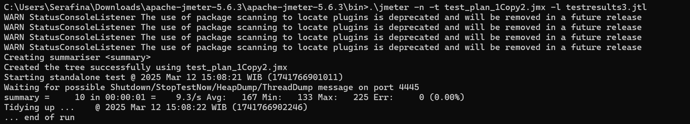
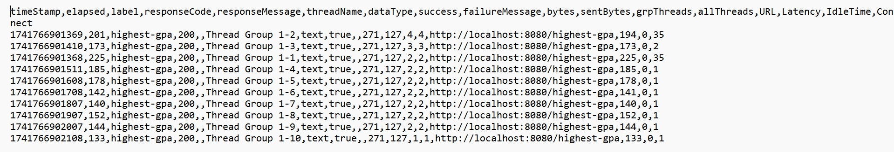

# JMeter Before Improvement 

### View Results In Table / all-student name

View Results In Table / highest-gpa

## JMeter After Improvement

### View Results In Table / all-student name

### View Results In Table / highest-gpa

### Conclusion
Based on the screenshots, I can conclude that after improving
the optimization, the execution time reduced from having to run in 
thousands of milliseconds to some only reaching double-digit millisecond time range.

## JMeter Using Command Line
### all-student name 

### highest-gpa

## Reflection
#### 1. What is the difference between the approach of performance testing with JMeter and profiling with IntelliJ Profiler in the context of optimizing application performance?
JMeter simulates user load to test overall performance, while IntelliJ Profiler digs into the code to see where time and memory are spent.

#### 2. How does the profiling process help you in identifying and understanding the weak points in your application?
Profiling shows which parts of the code are slow or resource-heavy, making it easier to find the weak spots.

#### 3. Do you think IntelliJ Profiler is effective in assisting you to analyze and identify bottlenecks in your application code?
Yes, it helps a lot by highlighting bottlenecks and showing detailed performance data.

#### 4. What are the main challenges you face when conducting performance testing and profiling, and how do you overcome these challenges?
Challenges include inconsistent results and high overhead. I overcome them by running multiple tests, using controlled environments, and cross-checking with other tools.

#### 5. What are the main benefits you gain from using IntelliJ Profiler for profiling your application code?
It gives a clear picture of resource usage, helps pinpoint slow code, and guides targeted optimizations.

#### 6. How do you handle situations where the results from profiling with IntelliJ Profiler are not entirely consistent with findings from performance testing using JMeter?
When results differ between IntelliJ Profiler and JMeter, I rerun tests, compare settings, and analyze both sets of data to understand the full picture.

#### 7. What strategies do you implement in optimizing application code after analyzing results from performance testing and profiling? How do you ensure the changes you make do not affect the application's functionality?
I focus on cleaning up slow functions and unnecessary operations. I make small controlled changes and run unit and performance tests to ensure nothing breaks.

